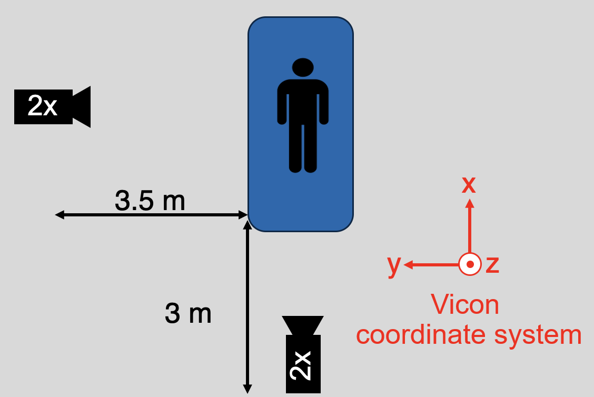

# Machine Learning CS-433 - Project 2: Movement recognition
*Written by Shrinidhi Singaravelan, Salya Diallo and Fanny Ghez*

## Necessary download:

In order to run this project, many library need to be download using the command `pip install` or `pip3 install`:
- `numpy` and `pandas` are the classical libraries that are used;
- `sklearn` is used for every method;
- `torch` and `tensorflow` are used for the Neural Networks;
- `matplotlib`, `plotly` and `seaborn` are used for visualizations.

## Import of the data:

Due to confidentiality of the data set, we cannot share it.
There is two different data sets: one was used for all methods (`All_Relative_Results_Cleaned.parquet`) and the other one was only used for the angle analysis (`All_Relative_Results_CleanedRelabeled.parquet`). In the beginning of each run notebook, change the data directory in order to be able to use it.

## Project description:

During this project, we had the opportunity to study a data set from the SMS lab at Balgrist Campus, a research campus located at the Balgrist University Hospital in Zurich under the supervision of David Rode. The project consisted of predicting the exercise (there is in total $7$ distinct movements) done by $25$ different participants using positional numerical values and time. Our data set contains $2210672$ data points with $104$ features: the participant, the exercise, the error that participant made, the camera that was used, the time and different distance (in meters) from the center of the hips values from 3 different axis.

Before starting with the classification, a data cleaning needed to be done. The given data set contained many rows with every positional values being *NaN* values. Hence, we decided to remove them since they were useless for our analysis. 

In order to solve this classification problem, we delved into different methods and played with the data set, by for example looking at angles - which could be an interesting approach for future research.

## Repository organization: 

In this repository, you may find various documents. Here is their uses:
- `neural_network.py`: implementation of different Neural networks with one hidden layer, using for example convolution or Adam optimization;
- `random_forest.py`: implementation of a random forest classification, without using sub-sampling for the hyper-parameters tuning;
- `classifiers.py`: classification functions using different classifier to predict on a certain test set (SVM and Random Forests) using sub-sampling for hyper-parameter tuning;
- `angle_functions.py`: computation of the angle values, angle max and min values over participants / exercises;
- `helpers.py`: data cleaning, separation into sub-matrices for each camera, plot of confusion matrices, computation of accuracy and F1 scores and splitting of the data using four different methods;
- `visualization.ipynb`: notebook with a few useful visualization of the data set to understand better the different exercises.

The different methods and result for solving our classification problem are divided in different notebooks, due to the length of each of them:
- `run_svm.ipynb` and `run_rf_subsamples.ipynb`: notebook with the classification using SVM and RF classifier respectively, and using a sub-sample training set for the hyper-parameter tuning;
- `run_RF.ipynb`: notebook with a Random Forest classification without using hyper-parameter tuning;
- `run_softmax_entropy.ipynb`: notebook with the softmax entropy method, using neural network with 1 hidden layer;
- `run_angle_analysis.ipynb` : notebook for angle analysis;
-  `run_NN_error_impact.ipynb`: notebook for  evaluating the impact of error on the NN accuracy.
